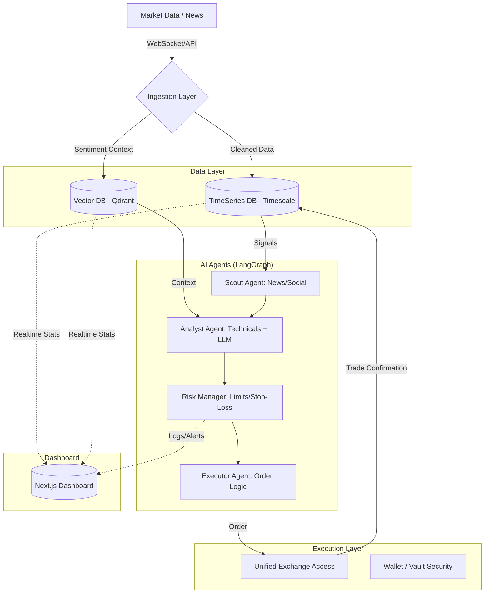

Questa è un'idea ambiziosa e affascinante che tocca le tre sfere più complesse dello sviluppo software moderno: **Finanza, Data Science/ML e Sicurezza**. Creare un sistema che non sia High-Frequency Trading (HFT) ma basato su logica di agenti AI strategici richiede un approccio molto diverso. Non serve micro-ottimizzazione in nanosecondi, ma precisione nell'analisi del contesto e robustezza esecutiva.

Ecco lo stack tecnologico che consiglio per costruire una piattaforma di questo tipo, diviso per livelli architetturali.

---

### 1. Core: Linguaggio di Programmazione
**Python 3.10+** (o superior)
*   **Perché:** È l'unico linguaggio serio per Data Science, Analisi Finanziaria e integrazione con librerie AI (LangChain, AutoGen, PyTorch/TensorFlow).
*   **Librerie Chiave:** `pandas`, `numpy`, `polars` (per velocità sui dataset), `ccxt` (per unificare le API delle exchange).

### 2. Back-end & Orchestrazione Agenti
Invece di un classico server REST, ti serve un'architettura a **Microservizi** o **Modulari**.

*   **API Framework:** **FastAPI**. È asincrono, molto veloce (simile al Go/Node.js ma in Python) e offre validazione automatica degli schemi. Gestisce bene le connessioni WebSocket per i dati di mercato.
*   **Orchestrazione Agenti AI:** **LangGraph** o **Microsoft AutoGen**.
    *   *Perché:* LangGraph permette di creare "workflow" stati (State Machines). Un agente può analizzare il trend, passare a un agente che gestisce il rischio, e solo poi all'agente che esegue l'order. Questo evita errori catastrofici in cui un LLM decide autonomamente senza controllo logico.
*   **Queue/Message Broker:** **RabbitMQ** o **Redis Streams**.
    *   Gli agenti devono comunicare tra loro in modo non bloccante. I dati di mercato arrivano -> Queue -> Agenti li processano -> Risposta.

### 3. Data Ingestion & Storage (Database)
Hai bisogno di gestire Time-Series e Contexto Testuale.

*   **Time-Series DB (Dati Storici/Tempo):** **TimescaleDB** (estensione di PostgreSQL) o **InfluxDB**.
    *   *Perché:* I mercati finanziari sono dati temporali. Ti servono query veloci per "qual è stata la volatilità degli ultimi 4 ore?". Timescale è scalabile e supporta SQL nativo, ottimo per analisi complesse.
*   **Vector Database (Contexto AI):** **Qdrant** o **Pinecone**.
    *   *Perché:* Gli agenti non leggono solo candele, devono leggere notizie, social sentiment, report macroeconomici. Serve un DB vettoriale per fare RAG (Retrieval-Augmented Generation) sugli eventi di mercato.
*   **Cache:** **Redis**. Per memorizzare lo stato dei prezzi in tempo reale e ridurre il carico sui DB.

### 4. Esecuzione Ordini (Execution Engine)
Questa è la parte più delicata. Non usare semplici `fetch` alle API.

*   **Unificazione Exchange:** La libreria **CCXT**. Supporta oltre 100 exchange crypto e molte forex. Gestisce la conversione dei parametri ordini tra le diverse piattaforme.
*   **WebSockets:** Implementazione personalizzata per ricevere dati in tempo reale (aggiornamenti ticker, liquidazioni) con `websocket-client` di Python o librerie integrate in FastAPI.
*   **Wallet & Security:** **Hardware Wallets** (Ledger/Trezor) via API se possibile, oppure gestione rigorosa delle chiavi private tramite **HashiCorp Vault** o un servizio cloud sicuro come **AWS KMS**. *Mai salvare le API key a vista nel codice.*

### 5. Frontend (Dashboard & Monitoraggio)
Non serve l'app di trading classica, ma una dashboard per monitorare cosa fanno gli agenti.

*   **Framework:** **Next.js (React)** o **Streamlit** (per MVP).
    *   *Opzione A (Prod):* Next.js con **D3.js**, **Plotly** o **TradingView Lightweight Charts**. Ti serve vedere la posizione degli ordini, il sentiment, e i log decisionali dell'AI in tempo reale.
    *   *Opzione B (Rapid Prototyping):* **Streamlit** per Python. Puoi costruire dashboard di dati interattivi in giorni. È perfetto per mostrare i trend e le performance agli utenti.

### 6. Architettura degli Agenti AI (Il "Cervello")
Qui definisci la logica. Non fare un unico LLM che dice "Compra".
Usa uno **Multi-Agent System**:

1.  **Scout Agent:** Monitora feed Twitter/Reddit e Notizie API (es. NewsAPI, LunarCRUSH). Invece di leggere, estrae segnali testuali.
2.  **Analyst Agent:** Riceve i dati tecnici (RSI, MACD, Volumi) + il sentiment dal Scout. Usa modelli come **Llama 3** (hostato localmente su GPU via vLLM o Ollama per privacy/velocità) per sintetizzare l'analisi del trend.
3.  **Risk Manager Agent:** La "coscienza". Controlla: *"Il rischio è troppo alto? Il drawdown massimo settimanale è raggiunto?"*. Blocca l'esecuzione se necessario.
4.  **Executor Agent:** Trasforma la decisione in un ordine di mercato o limit sull'exchange.

### 7. Infrastruttura & Deployment
*   **Containerization:** **Docker** & **Docker Compose**.
*   **Orchestrazione:** **Kubernetes (EKS/GKE)** se scala molto, altrimenti basta AWS EC2 o DigitalOcean Droplets per iniziare.
*   **Hosting AI:** Se usi modelli pesanti, non usarli in cloud pubblico per motivi di latenza/privacy. Usa un server locale con **NVIDIA GPU** + **vLLM** per inferenza localizzata.

---

### Schema Architetturale Semplificato

### Considerazioni Critiche (Legali e Tecniche)

1.  **Compliance (Molto Importante):**
    *   In Italia/Europa, offrire un servizio di "Trading Algoritmico" per conto terzi può essere regolamentato come **Gestione Patrimoniale**. Controlla le normative MiFID II.
    *   Non usare mai soldi propri se il sistema deve gestire denaro altrui senza licenza ISD (Investimento Service Directive).
2.  **Rischi di Mercato:**
    *   Gli agenti AI possono avere "allucinazioni". Un agente che crede di capire un trend potrebbe spingere contro una liquidazione flash crash. È fondamentale implementare uno **Stop-Loss hardware/software** esterno all'AI.
3.  **Costi API:**
    *   Le API delle exchange (Binance, Bybit) hanno limiti gratuiti stretti. Per il trading vero, dovrai pagare piani Enterprise o usare un broker istituzionale come Interactive Brokers (se supporta crypto).
4.  **Backtesting:**
    *   Prima di mettere soldi veri, fai una fase massiccia di backtesting su dati storici. Librerie consigliate: `backtrader` o `vectorbt`.

### Roadmap Consigliata per l'MVP

1.  **Fase 1 (Analisi):** Costruisci un bot che legge i dati e ti stampa su Telegram l'analisi del trend giornaliero.
2.  **Fase 2 (Sandbox):** Collegalo a un exchange in modalità "Paper Trading" (soldi finti) con `ccxt`. Fai eseguire gli ordini senza fondi reali per vedere la latenza e l'esecuzione.
3.  **Fase 3 (Agenti):** Aggiungi l'Llama locale via API (vLLM) per generare il *reasoning* prima dell'ordine, visibile nella dashboard.
4.  **Fase 4 (Reale):** Collega un conto reale con limiti di budget bassissimi e monitora strettamente.

Questo stack ti permette di mantenere la massima flessibilità in Python (per l'AI) senza sacrificare la velocità dove serve (con FastAPI/CCXT).