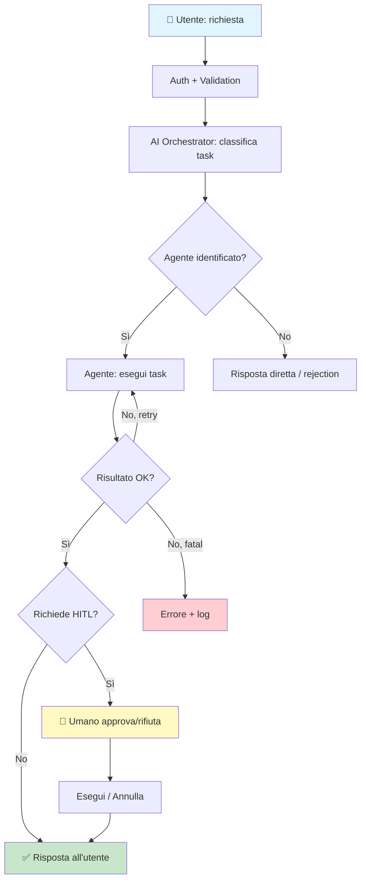
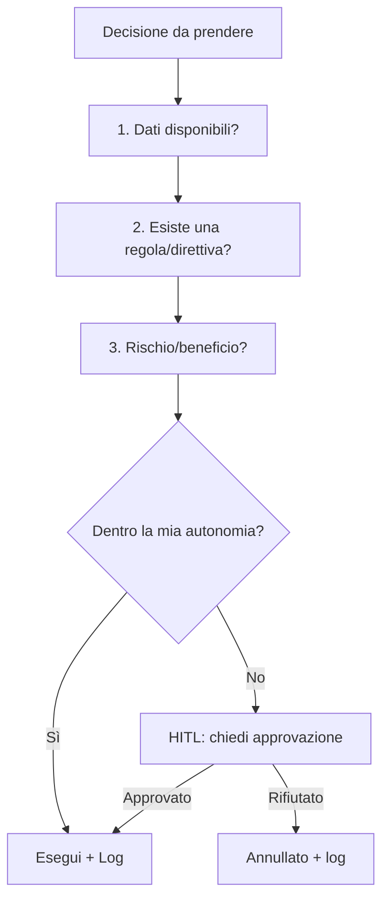

# Catena Decisionale

> Ultimo aggiornamento: {{DATE}}

## Flow: Richiesta utente → Risultato

<!-- Adatta al flusso del tuo progetto. Questo è un template generico per sistemi AI con HITL. -->

## Decision Framework

<!-- Ogni decisione autonoma dell'AI segue questo framework. -->

