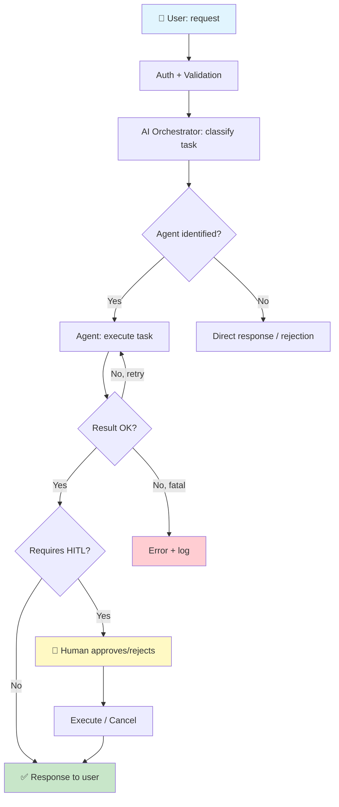
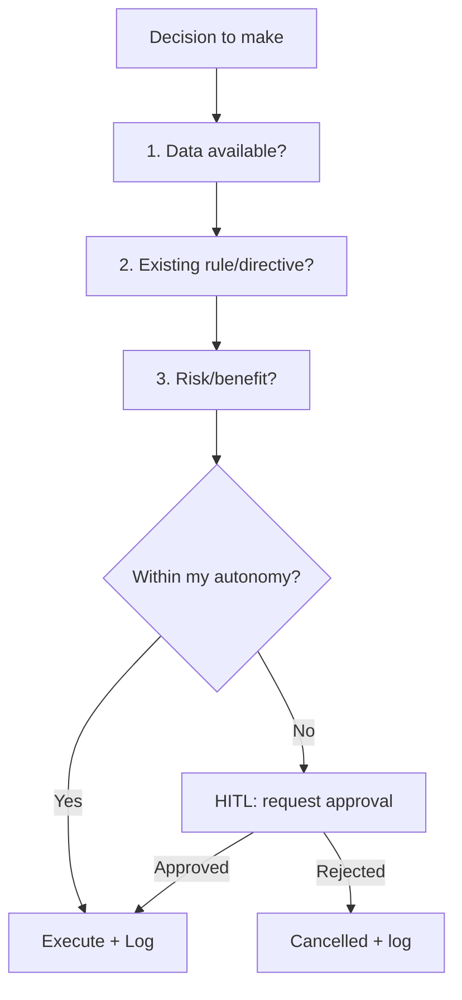

# Decision Chain

> Last updated: {{DATE}}

## Flow: User request → Result

<!-- Adapt to your project's flow. This is a generic template for AI systems with HITL. -->

## Decision Framework

<!-- Every autonomous AI decision follows this framework. -->

