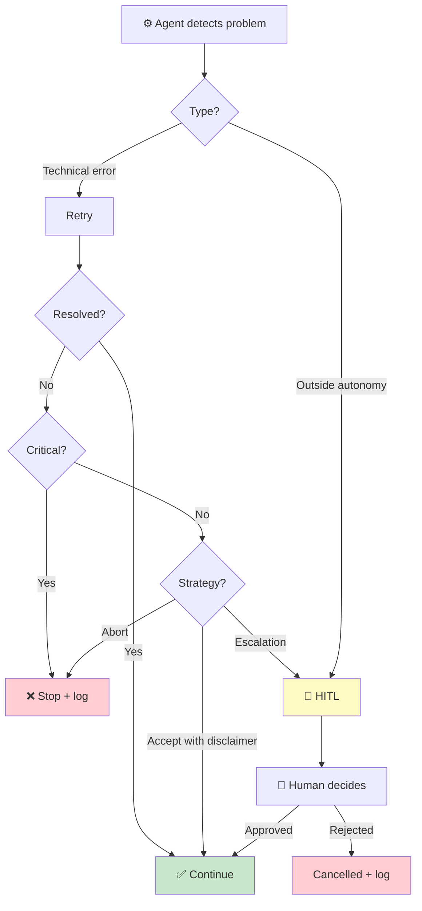

# Escalation Schema

> Last updated: {{DATE}}

## Escalation tree

## Unconditional escalation triggers

<!-- These triggers ALWAYS cause escalation, regardless of the HITL level. -->
<!-- Adapt to your project's reality. -->

| # | Trigger | Rationale |
|---|---|---|
| 1 | Real expense involved | Budget at risk |
| 2 | Irreversible impact | Sending, publishing, deploying |
| 3 | Decision outside directives | No applicable rule |
| 4 | Interpersonal situation | Conflict, complaint, negotiation |
| 5 | Subjective judgment | Subjectivity not algorithmizable |
| 6 | Repeated anomaly (3+ times) | Structural error pattern |

## HITL Levels

| Level | Behavior | Promoted by |
|---|---|---|
| `full_manual` | Every action requires approval | Default |
| `escalation` | Only high-risk decisions | Human partner |
| `low_risk` | Only unconditional triggers | Human partner |
| `full_auto` | No interruption (log-only) | Human partner + periodic review |
