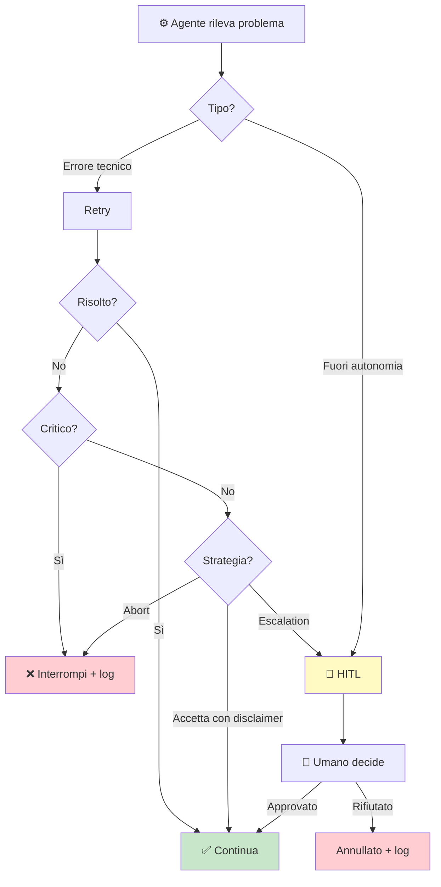

# Schema di Escalation

> Ultimo aggiornamento: {{DATE}}

## Albero escalation

## Trigger di escalation incondizionati

<!-- Questi trigger causano SEMPRE escalation, indipendentemente dal livello HITL. -->
<!-- Adatta alla realtà del tuo progetto. -->

| # | Trigger | Motivazione |
|---|---|---|
| 1 | Spesa reale coinvolta | Budget a rischio |
| 2 | Impatto irreversibile | Invio, pubblicazione, deploy |
| 3 | Decisione fuori direttive | Nessuna regola applicabile |
| 4 | Situazione interpersonale | Conflitto, reclamo, negoziazione |
| 5 | Giudizio soggettivo | Soggettività non algoritmizzabile |
| 6 | Anomalia ripetuta (3+ volte) | Pattern di errore strutturale |

## Livelli HITL

| Livello | Comportamento | Chi promuove |
|---|---|---|
| `full_manual` | Ogni azione richiede approvazione | Default |
| `escalation` | Solo decisioni ad alto rischio | Partner umano |
| `low_risk` | Solo trigger incondizionati | Partner umano |
| `full_auto` | Nessuna interruzione (log-only) | Partner umano + review periodica |
