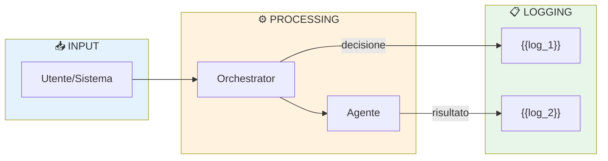

# Matrice Tracciabilità

> Ultimo aggiornamento: {{DATE}}

## Dove si registra ogni tipo di evento

<!-- Una riga per tipo di evento. Se non hai una tabella DB, indica file di log o "non tracciato". -->

| Evento | Dove | Campi chiave | Chi logga | Retention |
|---|---|---|---|---|
| Decisione routing | {{tabella/file}} | {{campi}} | {{componente}} | {{retention}} |
| Sessione AI completa | {{tabella/file}} | {{campi}} | {{componente}} | {{retention}} |
| Costo LLM | {{tabella/file}} | {{campi}} | {{componente}} | {{retention}} |
| Azione utente | {{tabella/file}} | {{campi}} | {{componente}} | {{retention}} |
| Errore/anomalia | {{tabella/file}} | {{campi}} | {{componente}} | {{retention}} |

## Flow tracciabilità

