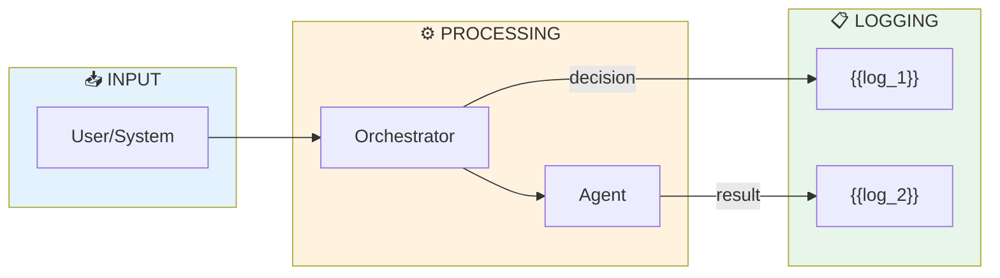

# Traceability Matrix

> Last updated: {{DATE}}

## Where each event type is logged

<!-- One row per event type. If you don't have a DB table, indicate log file or "not tracked". -->

| Event | Where | Key fields | Logged by | Retention |
|---|---|---|---|---|
| Routing decision | {{table/file}} | {{fields}} | {{component}} | {{retention}} |
| Complete AI session | {{table/file}} | {{fields}} | {{component}} | {{retention}} |
| LLM cost | {{table/file}} | {{fields}} | {{component}} | {{retention}} |
| User action | {{table/file}} | {{fields}} | {{component}} | {{retention}} |
| Error/anomaly | {{table/file}} | {{fields}} | {{component}} | {{retention}} |

## Traceability flow

